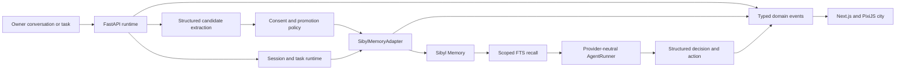

# A-Brain

> **Agents forget when sessions end. Their brain shouldn't.**

A-Brain is a playable continuity layer for AI agents. It stores durable owner context in
[Sibyl Memory](https://github.com/Sibyl-Labs/Sibyl-Memory), destroys the current runtime, starts a
genuinely fresh session, and retrieves only the memories relevant to the next request. Its 2D city
turns those real backend events into visible memory shards, agent movement, session portals, and a
side-by-side deletion test.

[Watch the 3:13 demo](https://vimeo.com/1222920883) ·
[Read the architecture](./docs/ARCHITECTURE.md) ·
[Run the demo flow](./docs/DEMO.md)


## Why it exists

An agent session is temporary. The useful context behind it—preferences, constraints, decisions,
goals, project state—should not disappear with the process.

A-Brain separates a persistent **brain identity** from ephemeral **session identities**:

```text
brain: nova
├── session: nova-001  TERMINATED
└── session: nova-002  FRESH
```

The new session receives no previous chat history. It can continue only by retrieving relevant
records through Sibyl. Disable Sibyl and the same request safely asks for missing context instead
of inventing a memory.

## The proof in one minute

1. Create an agent with an empty brain.
2. Say: `Remember this: Project Nox requires staging security approval before shipping.`
3. Gemini extracts a typed candidate; policy decides whether it can be promoted.
4. Sibyl confirms the write before the city materializes a memory shard.
5. Restart the agent. The old session ends and transient turns are cleared.
6. Ask the fresh session: `Can we ship Project Nox now?`
7. Sibyl FTS returns the relevant record and the agent blocks the unsafe release.
8. Run **Compare continuity**. The identical memory-off lane recalls zero records and asks for
   context.


## Memory is load-bearing

Remove Sibyl Memory and A-Brain loses its core function: cross-session continuity.

| With Sibyl | Memory disabled |
| --- | --- |
| Fresh session retrieves scoped memory IDs | Fresh session receives zero records |
| Prior constraints influence the next action | Agent cannot reproduce the tailored action |
| Provenance links source, write, recall, and decision | Agent safely requests missing context |


This is not vector or semantic search. Normal recall uses Sibyl's verified SQLite FTS/search path,
then applies deterministic owner and NPC scope checks while preserving provider rank, snippet,
tier, source, query, and relevance metadata. Sibyl Memory 0.8.0 “Lucid” adds a deterministic
zero-result verdict; A-Brain preserves that provider explanation and performs at most one
provider-authorized token-removal retry. It never strips arbitrary user words or turns a
zero-result into invented memory.

## Architecture



The backend is authoritative. The browser never writes directly to Sibyl, and the world never
animates a successful memory operation until the provider has confirmed it.

### Sibyl tier mapping

| A-Brain data | Sibyl layer | Purpose |
| --- | --- | --- |
| Active task and handoff state | HOT state | Current resumable work |
| Preferences, constraints, people, goals, decisions | WARM entities | Durable owner context |
| Writes, recalls, restarts, task and provenance events | COLD journal | Chronological evidence |
| Named durable documents | REFERENCE | Reusable material when applicable |
| Superseded records | ARCHIVE | Explicit lifecycle management |

### Critical implementation paths

- Sibyl boundary and verified CRUD: [`adapter.py`](./backend/src/abrain_api/memory/adapter.py)
- Write durable context:
  [`SibylMemoryAdapter.write`](./backend/src/abrain_api/memory/adapter.py#L109)
- Search and scoped recall:
  [`recall_with_metadata`](./backend/src/abrain_api/memory/adapter.py#L254)
- HOT task state:
  [`write_task_state`](./backend/src/abrain_api/memory/adapter.py#L145)
- Archive and delete lifecycle:
  [`archive`](./backend/src/abrain_api/memory/adapter.py#L346) and
  [`delete`](./backend/src/abrain_api/memory/adapter.py#L357)
- Session restart: [`session_runtime.py`](./backend/src/abrain_api/modules/session_runtime.py)
- Provider-neutral agent execution:
  [`agent_runner.py`](./backend/src/abrain_api/modules/agent_runner.py)
- Typed memory model: [`memory.py`](./backend/src/abrain_api/modules/memory.py)
- Event-driven city: [`pixi-world.tsx`](./frontend/src/components/pixi-world.tsx)
- Process-boundary proof:
  [`test_process_boundary_continuity.py`](./backend/tests/test_process_boundary_continuity.py)
- Scoped handoff isolation: [`test_handoffs_api.py`](./backend/tests/test_handoffs_api.py)

## Product capabilities

- Empty-brain onboarding with persistent owner and agent identities.
- Arbitrary conversation with structured memory-candidate extraction.
- Explicit memory consent, confirmation, Undo, edit, archive, and forget.
- Generic owner-context types: person, preference, relationship, habit, decision, constraint,
  value, goal, project, and event.
- Arbitrary tasks with queued → thinking → working → blocked/review → completed state.
- Fresh-session restart with distinct session IDs and zero inherited transient turns.
- Memory-influenced decisions with exact used-memory IDs.
- Causal replay: source → Sibyl write → fresh recall → changed decision.
- Real memory-on versus memory-off continuity comparison.
- Optional scoped delegation to at most two specialist agents; unrelated memories are withheld.
- Responsive light/dark UI, reduced motion, and an HTML/CSS city fallback when WebGL is unavailable.

## Run locally

### Requirements

- Node.js 20+
- Corepack and pnpm 11
- Python 3.11+

### Install

```bash
git clone https://github.com/Anand-0038/abrain.git
cd abrain

corepack pnpm install --frozen-lockfile
python3 -m venv .venv
source .venv/bin/activate
python3 -m pip install -e 'backend[dev]'

cp .env.example .env
cp frontend/.env.example frontend/.env.local
```

Sibyl's local SQLite provider requires no API key. The default `.env.example` uses real local Sibyl
memory with credential-free extraction disabled and the deterministic local agent runner enabled.

### Start

Terminal 1:

```bash
source .venv/bin/activate
corepack pnpm backend:dev
```

Terminal 2:

```bash
corepack pnpm dev:frontend
```

Open [http://127.0.0.1:3000](http://127.0.0.1:3000).

### Optional Gemini providers

To enable structured extraction and model-backed agent decisions, update the ignored `.env`:

```dotenv
ABRAIN_MODEL_PROVIDER=gemini
ABRAIN_AGENT_PROVIDER=gemini
ABRAIN_GEMINI_API_KEY=your_key
ABRAIN_GEMINI_MODEL=gemini-3.5-flash-lite
```

The provider returns strict structured output. A-Brain rejects used-memory IDs that Sibyl did not
actually return. Transient network, HTTP 429, and 5xx failures receive bounded retries; permanent
errors and malformed output fail closed.

## Verify

With frontend and backend running:

```bash
PATH="$PWD/.venv/bin:$PATH" corepack pnpm verify:local
```

Or run individual gates:

```bash
corepack pnpm format:check
corepack pnpm lint
corepack pnpm typecheck
corepack pnpm test
corepack pnpm build
git diff --check
```

The current release passes 12 frontend tests and 53 backend tests, including owner isolation,
provider reopen, fresh-process recall, disabled-memory degradation, candidate policy, memory CRUD,
task lifecycle, causal replay, and scoped handoff isolation.

## Repository layout

```text
abrain/
├── backend/       FastAPI runtime, Sibyl adapter, agent and task logic
├── contracts/     shared domain-event schema
├── frontend/      Next.js interface and PixiJS world
├── docs/          architecture, demo runbook, design, and screenshots
└── scripts/       local acceptance verification
```

## Current boundary

Verified in this release:

- real local Sibyl SDK and SQLite persistence;
- real Gemini extraction and agent execution when configured;
- browser UI write, restart, fresh recall, causal replay, and deletion comparison;
- process-boundary reopen and owner isolation;
- public source repository and recorded demo.

Not claimed:

- hosted Sibyl service or hosted A-Brain application;
- production authentication or cross-device owner sync;
- Base or Virtuals partner integration;
- semantic/vector retrieval;
- external research or autonomous real-world side effects.

## Prior work

The A-Brain concept and initial repository scaffold existed before the hackathon build window. The
Sibyl-backed memory lifecycle, fresh-session continuity runtime, task and scoped-handoff systems,
event-driven city, deletion comparison, causal replay, tests, and submitted demo were implemented
during the Sep 1–10, 2026 build window.

The compatibility city uses a curated subset of Kenney Tiny Town 1.1 under CC0. Its upstream
license is preserved beside the files at
[`frontend/public/assets/kenney-tiny-town/LICENSE.txt`](./frontend/public/assets/kenney-tiny-town/LICENSE.txt).
All dependencies remain documented by the checked-in manifests and lockfile.

## License

[MIT](./LICENSE) © 2026 Anand Vashishtha
