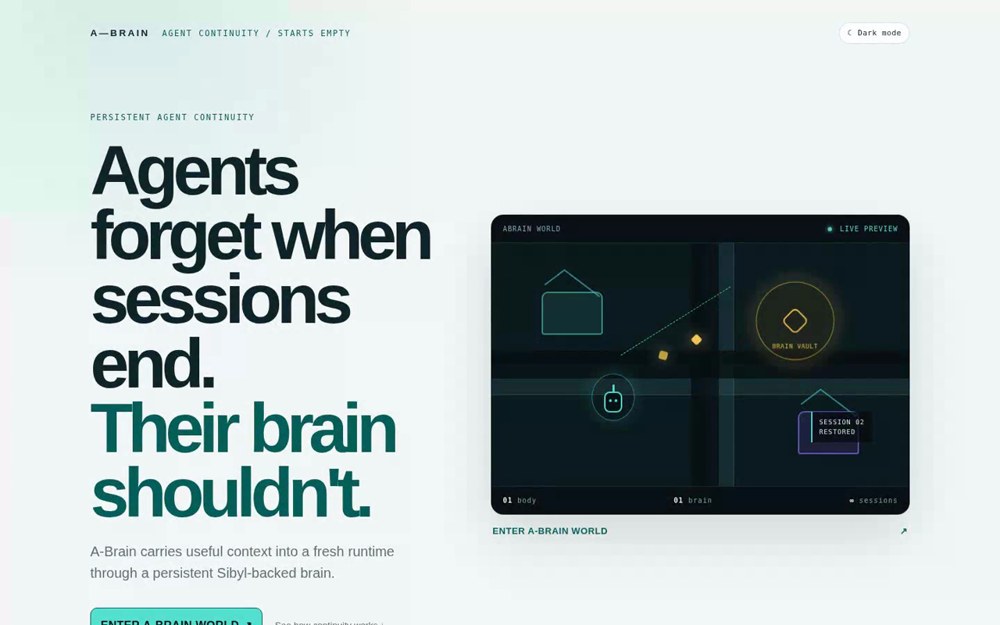
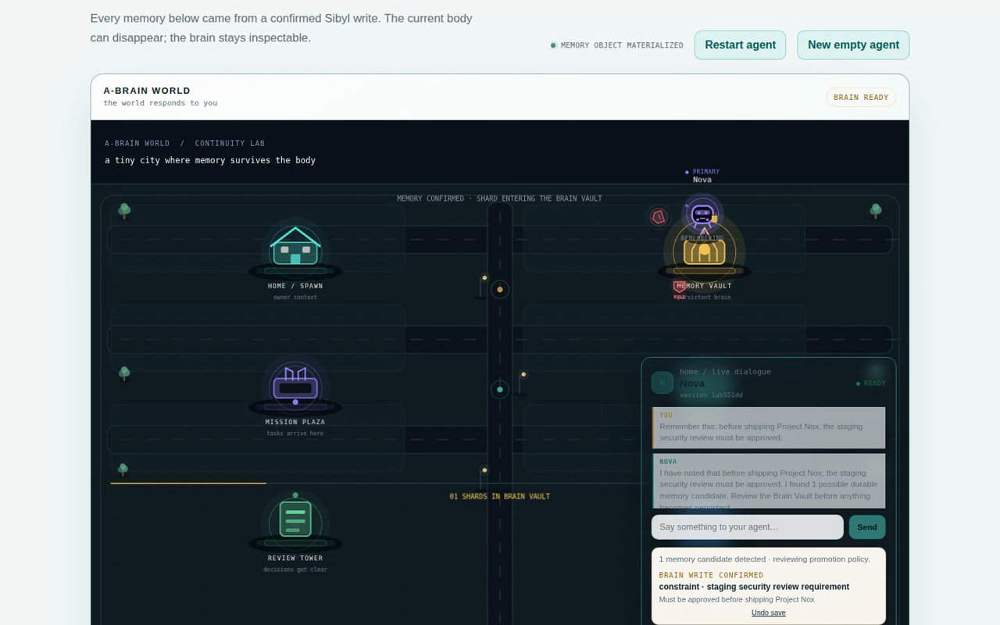
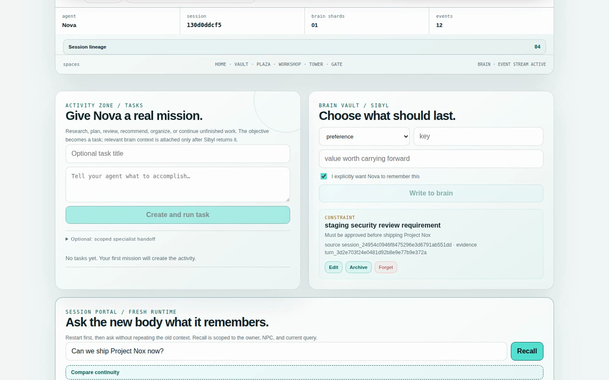
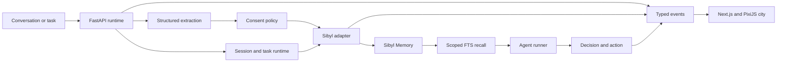

# A-Brain

> **Agents forget when sessions end. Their brain shouldn't.**

A-Brain gives an AI agent a persistent brain. It remembers useful preferences, constraints,
decisions, and unfinished work through [Sibyl Memory](https://github.com/Sibyl-Labs/Sibyl-Memory),
then restores only the relevant context when a completely new session starts.

[Watch the 3:13 demo](https://vimeo.com/1222920883) ·
[Architecture details](./docs/ARCHITECTURE.md) ·
[Demo walkthrough](./docs/DEMO.md)



## The problem

Agent sessions are temporary, but the context behind useful work is not. When a process restarts,
an agent can lose a person's preferences, project constraints, past decisions, and current task.
Passing the old transcript into every new session is noisy, difficult to control, and not a durable
memory model.

## The solution

A-Brain separates one persistent brain identity from many short-lived session identities:

```text
brain: nova
├── session: nova-001  TERMINATED
└── session: nova-002  FRESH
```

The fresh session receives no earlier conversation history. Before acting, it searches the owner's
Sibyl memory, verifies the returned records belong to the correct owner and agent, and gives only
those records to the decision pipeline. If memory is unavailable, the agent asks for the missing
context instead of pretending to remember.

## See it work

1. Create an agent with an empty brain.
2. Tell it: `Remember this: Project Nox requires security approval before shipping.`
3. A-Brain extracts a structured candidate and applies its consent policy.
4. Sibyl confirms the write; only then does a memory shard enter the Brain Vault.
5. Restart the agent. The old session terminates and its transient conversation is cleared.
6. Ask the fresh agent: `Can we ship Project Nox now?`
7. Sibyl FTS returns the constraint, so the agent blocks the unsafe action.
8. Run **Compare continuity**. The equivalent memory-off path cannot recover the constraint.



The Continuity Arena runs both paths through the real application. It reports a changed decision
only when the agent actually used a memory ID returned by Sibyl.



## How it works



The backend owns the truth. The browser never writes directly to Sibyl, and the city never shows a
successful memory operation until Sibyl confirms it.

| A-Brain data | Sibyl layer | Use |
| --- | --- | --- |
| Current task and handoff state | HOT state | Resumable work |
| Preferences, constraints, people, goals, and decisions | WARM entities | Durable context |
| Writes, recalls, restarts, and task events | COLD journal | Chronological provenance |
| Named durable documents | REFERENCE | Reusable source material |
| Superseded records | ARCHIVE | Explicit lifecycle management |

Recall currently uses Sibyl's SQLite FTS/search path, not vector or embedding-based semantic
search. A-Brain preserves the query, rank, snippet, tier, source, and Sibyl 0.8.0 zero-result
verdict, then applies deterministic owner and agent scope checks.

### Important code paths

- Sibyl writes, search, HOT state, archive, and delete:
  [`backend/src/abrain_api/memory/adapter.py`](./backend/src/abrain_api/memory/adapter.py)
- Fresh-session lifecycle:
  [`backend/src/abrain_api/modules/session_runtime.py`](./backend/src/abrain_api/modules/session_runtime.py)
- Agent decisions and used-memory validation:
  [`backend/src/abrain_api/modules/agent_runner.py`](./backend/src/abrain_api/modules/agent_runner.py)
- Typed memory records:
  [`backend/src/abrain_api/modules/memory.py`](./backend/src/abrain_api/modules/memory.py)
- Event-driven world:
  [`frontend/src/components/pixi-world.tsx`](./frontend/src/components/pixi-world.tsx)
- Process-restart continuity test:
  [`backend/tests/test_process_boundary_continuity.py`](./backend/tests/test_process_boundary_continuity.py)
- Scoped handoff isolation test:
  [`backend/tests/test_handoffs_api.py`](./backend/tests/test_handoffs_api.py)

## Run locally

Requirements: Node.js 20+, Corepack with pnpm 11, and Python 3.11+.

```bash
git clone https://github.com/Anand-0038/abrain.git
cd abrain

corepack pnpm install --frozen-lockfile
python3 -m venv .venv
source .venv/bin/activate
python3 -m pip install -e 'backend[dev]'

cp .env.example .env
cp frontend/.env.example frontend/.env.local
```

Start the backend:

```bash
source .venv/bin/activate
corepack pnpm backend:dev
```

In another terminal, start the frontend:

```bash
corepack pnpm dev:frontend
```

Open [http://127.0.0.1:3000](http://127.0.0.1:3000). Local Sibyl SQLite memory requires no API
key.

### Optional Gemini execution

Add these values to the ignored `.env` to enable structured extraction and model-backed agent
decisions:

```dotenv
ABRAIN_MODEL_PROVIDER=gemini
ABRAIN_AGENT_PROVIDER=gemini
ABRAIN_GEMINI_API_KEY=your_key
ABRAIN_GEMINI_MODEL=gemini-3.5-flash-lite
```

A-Brain validates the provider's structured output and rejects any used-memory ID that Sibyl did
not return.

## Verify

```bash
corepack pnpm format:check
corepack pnpm lint
corepack pnpm typecheck
corepack pnpm test
corepack pnpm build
git diff --check
```

With both services running, execute the local acceptance flow:

```bash
PATH="$PWD/.venv/bin:$PATH" corepack pnpm verify:local
```

Tests cover owner isolation, provider reopening, process-boundary recall, memory-disabled
degradation, memory lifecycle, task state, causal replay, and scoped handoff isolation.

## Current limits

The repository verifies local Sibyl persistence and optional Gemini provider calls. It does not
claim a hosted A-Brain service, production authentication, cross-device sync, Base or Virtuals
integration, semantic/vector retrieval, external research, or autonomous real-world actions.

## Prior work

The product concept and initial repository scaffold existed before the hackathon build window. The
Sibyl-backed memory lifecycle, fresh-session runtime, task and scoped-handoff systems, event-driven
city, deletion comparison, causal replay, tests, and recorded demo were built during the Sep 1-10,
2026 window.

The fallback city uses a curated subset of Kenney Tiny Town 1.1 under CC0. The original license is
included at
[`frontend/public/assets/kenney-tiny-town/LICENSE.txt`](./frontend/public/assets/kenney-tiny-town/LICENSE.txt).

## License

[MIT](./LICENSE) © 2026 Anand Vashishtha
