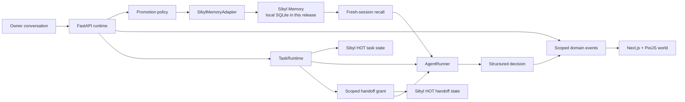

# A-Brain architecture

A-Brain is an agent-continuity product. The browser is a visual client; the FastAPI runtime owns
identity, session, conversation, memory, and event truth.



## Memory is load-bearing

The core path is:

```text
conversation → candidate extraction → promotion → Sibyl write
→ terminate session → start a clean session → Sibyl recall
→ decision changes → action response
```

Disabling the adapter does not load a cache or replay a transcript. The same decision policy
returns `continuity_unavailable` and asks for the missing context. This is the deletion test.

## Exact implementation locations

- Sibyl provider boundary: `backend/src/abrain_api/memory/adapter.py`
- Generic owner-context records: `backend/src/abrain_api/modules/memory.py`
- Candidate extraction and promotion policy: `backend/src/abrain_api/modules/`
- Session identity and restart: `backend/src/abrain_api/modules/session_runtime.py`
- Fresh recall and changed-behavior decision: `backend/src/abrain_api/main.py`
- Sibyl search metadata and deterministic owner/NPC filtering: `backend/src/abrain_api/memory/adapter.py`
- Provider-neutral agent execution and Gemini/local implementations: `backend/src/abrain_api/modules/agent_runner.py`
- Generic task model/runtime: `backend/src/abrain_api/modules/tasks.py`
- Task API and lifecycle event orchestration: `backend/src/abrain_api/main.py`
- Scoped handoff model/runtime: `backend/src/abrain_api/modules/handoff.py`
- Handoff authorization, specialist limits, and child-task execution: `backend/src/abrain_api/main.py`
- Domain event validation: `backend/src/abrain_api/contracts.py`
- Wire schema: `contracts/domain-events.schema.json`
- Frontend event validation: `frontend/src/lib/events.ts`
- Pixi world projection: `frontend/src/components/pixi-world.tsx`. The renderer uses original
  procedural geometry for a six-space tiny city: Home/Spawn, Memory Vault, Mission Plaza,
  Workshop, Review Tower, and Session Gate. Roads, blocks, vegetation, lamps, and building
  silhouettes are presentation-only; backend events remain authoritative. NPC identity comes from
  the persisted record and selects a reusable body silhouette, palette, role label, and lifecycle
  state; no named character is hard-coded into the renderer.

## Ownership boundaries

Every application memory, NPC, session, conversation, and non-system event read is scoped to the
owner and NPC. The frontend never writes directly to Sibyl and never treats a visual animation as
proof of success.
The Pixi scene responds only to confirmed event payloads and returned memory IDs.

For a non-empty fresh-session query, `SibylMemoryAdapter.recall_with_metadata()` calls the installed
Sibyl `MemoryClient.search()` API over WARM entities and carries the provider rank, snippet, query,
tier, source, and relevance reason into the continuity response. This is provider search/FTS, not
semantic/vector retrieval. HOT state and COLD journal records are intentionally persisted for their
respective state/provenance roles and are not parsed as structured `MemoryRecord` results.

The runner receives the current request, NPC role/personality, current session/task state, and only
those retrievals. Its structured result contains `response`, `plan`, `proposed_action`,
`used_memory_ids`, `memory_effect`, `needs_more_context`, and optional `task_update`. The local
runner is the credential-free default; `ABRAIN_AGENT_PROVIDER=gemini` selects the Gemini REST
implementation. Both implementations enforce that `used_memory_ids` is a subset of IDs returned by
Sibyl. The behavior-change event is emitted from that validated subset, never merely because a
record happened to be available.

## Task lifecycle

Tasks are created from arbitrary user objectives. There are no mission-specific branches in the
runtime. `AgentTask` keeps the owner, assigned NPC, objective, status, current step, result,
parent task, and relevant memory IDs. `TaskRuntime` is only a short-lived lookup/index; every
transition is written through `SibylMemoryAdapter.write_task_state()` to a HOT state document at
`task:{task_id}`, then verified before the corresponding UI event is emitted.

The task run searches Sibyl WARM entities for the objective, supplies those retrievals plus the
HOT task snapshot to `AgentRunner`, and returns the agent's structured result and provenance. It
emits `task.created`, `task.started`, `task.step_changed`, and either `task.blocked` or
`task.completed`. Blocked/review tasks can be run again after the owner supplies context or review.
If a completed result was actually memory-influenced, the result is promoted as
a WARM `decision`; the adapter also records the COLD provenance event. The Pixi Activity Zone
reacts only to those confirmed task events.

## Bounded multi-agent delegation

The owner has one primary persistent NPC and may add at most two specialist NPCs. The roster is
intentionally bounded to planner, worker, and reviewer roles; there is no autonomous population or
civilization simulation. A source task can call `POST /api/tasks/{task_id}/handoffs` with a target
specialist and selected memory IDs. The runtime validates the owner, source agent, target role, and
each selected record before creating a child task.

The handoff stores a small provenance-bearing context snapshot in Sibyl HOT state at
`handoff:{handoff_id}`. When the child runs, the runner receives only those snapshot records as
`abrain_scoped_handoff` retrievals; it does not search the target agent's broader owner brain. The
runner's `used_memory_ids` is still validated against that supplied subset, and result memories are
written under the target NPC. This makes the permission layer an A-Brain responsibility over Sibyl,
not a claim that Sibyl itself supplies agent ACLs.

The lifecycle is visible through `handoff.created`, `handoff.accepted`, `handoff.started`, and
`handoff.completed`/`handoff.blocked`. A real mission can therefore run primary → worker, and the
worker can create a second scoped child for an optional reviewer. Tests prove that unrelated source
records and target-private records never enter the worker runner request.

## Current proof boundary

The verified implementation uses a local Sibyl SQLite provider and an in-process FastAPI runtime.
Hosted Sibyl, authentication, public deployment, Base, Virtuals, and cross-machine recovery are
not claimed by this release.
